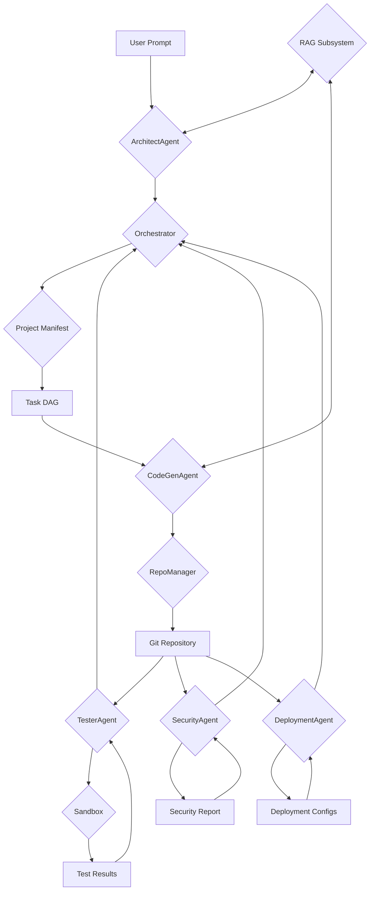

# System Architecture: AI-Powered Project Generator

This document outlines the architecture for a system that generates complete multi-module software projects from a single high-level prompt.

## 1. Overall System Architecture

The system follows a modular, agent-based architecture. The core components are an Orchestrator, a set of specialized Agents, a Retrieval-Augmented Generation (RAG) subsystem, and a secure Sandbox for code execution.

### Data Flow:

1.  **Input:** The system receives a high-level project requirement as a prompt.
2.  **Planning:** The `ArchitectAgent` receives the prompt, augmented with relevant information from the RAG subsystem, and creates a detailed project manifest. This manifest lists all the modules, components, and their dependencies.
3.  **Orchestration:** The `Orchestrator` takes the project manifest and creates a Directed Acyclic Graph (DAG) of tasks. It then schedules and manages the execution of these tasks.
4.  **Code Generation:** The `Orchestrator` dispatches tasks to various `CodeGenAgent` instances, which generate code for specific modules. These agents also use the RAG subsystem for context.
5.  **Code Management:** The generated code is committed to a Git repository by the `RepoManager`, which ensures versioning and provenance.
6.  **Testing:** The `TesterAgent` runs tests on the generated code in a secure `Sandbox`.
7.  **Security:** The `SecurityAgent` scans the code for vulnerabilities and compliance issues.
8.  **Deployment:** The `DeploymentAgent` generates deployment configurations (Dockerfiles, Kubernetes manifests).
9.  **Human-in-the-Loop:** For critical issues or approvals, the system can pause and wait for human intervention via a review UI.
10. **Output:** The final output is a complete, tested, and deployable software project in a Git repository.

### Dependencies:

-   **Orchestrator:** Depends on all other subsystems to manage the workflow.
-   **Agents:** Depend on the RAG subsystem for contextual information and the Sandbox for execution.
-   **RAG:** Depends on a vector database and embedding models.
-   **RepoManager:** Depends on a Git implementation.
-   **Sandbox:** Depends on containerization technology (e.g., Docker).

## 2. Required Subsystems

-   **Orchestrator:** Manages the entire workflow, from planning to deployment.
-   **Agents:**
    -   `ArchitectAgent`: Creates the project plan/manifest.
    -   `CodeGenAgent`: Generates code.
    -   `TesterAgent`: Runs tests and suggests fixes.
    -   `SecurityAgent`: Scans for vulnerabilities.
    -   `DeploymentAgent`: Generates deployment configurations.
    -   `FixerAgent`: Attempts to fix issues found by other agents.
-   **Retrieval-Augmented Generation (RAG):**
    -   `Indexer`: Ingests and indexes documents into a vector database.
    -   `Retriever`: Retrieves relevant context for the agents.
-   **RepoManager:** Manages the Git repository for the generated project.
-   **Sandbox:** A secure environment for running tests and builds.
-   **Test Runner:** Executes tests within the sandbox.
-   **Security Scanners:** Tools for static analysis, dependency checking, and license scanning.
-   **Deployment:** Tools for generating deployment configurations.
-   **Human-in-the-Loop (HITL):** A UI/API for human review and approval.

## 3. Software Engineering Principles

-   **SOLID:**
    -   **S**ingle Responsibility Principle: Each agent and subsystem has a single, well-defined responsibility.
    -   **O**pen/Closed Principle: Subsystems are open for extension (e.g., adding new agents) but closed for modification.
    -   **L**iskov Substitution Principle: Different agent implementations are interchangeable.
    -   **I**nterface Segregation Principle: Agents communicate through well-defined, minimal interfaces.
    -   **D**ependency Inversion Principle: High-level modules (Orchestrator) depend on abstractions (BaseAgent), not concrete implementations.
-   **DRY (Don't Repeat Yourself):** Reusable components and logic are encapsulated in agents and libraries.
-   **KISS (Keep It Simple, Stupid):** The design favors simplicity and clarity over unnecessary complexity.
-   **Modularity:** The system is composed of independent, interchangeable modules.

## 4. Suggested Python Frameworks/Libraries

| Subsystem | Framework/Library | Justification |
| :--- | :--- | :--- |
| Orchestrator | `Prefect` or `Temporal` | For robust workflow management, retries, and state tracking. `asyncio` for simpler cases. |
| Agents | `LangChain` or custom framework | For building LLM-powered agents. |
| RAG | `ChromaDB` or `FAISS` (Vector DB), `Sentence-Transformers` (Embeddings) | For efficient vector storage and retrieval. |
| RepoManager | `pygit2` | For programmatic Git operations. |
| Sandbox | `Docker SDK for Python` | For container management. |
| Testing | `pytest`, `unittest` | Standard Python testing frameworks. |
| Security | `bandit` (SAST), `pip-audit` (Dependencies), `scancode-toolkit` (Licenses) | For comprehensive security scanning. |
| Deployment | `Jinja2` (Templates), `kubernetes-client` | For generating configuration files. |
| HITL API | `FastAPI` | For building a fast, modern API with automatic documentation. |
| Config | `PyYAML` or `toml` | For structured configuration files. |
| Logging | `structlog` | For structured, machine-readable logs. |

## 5. Design Diagram

