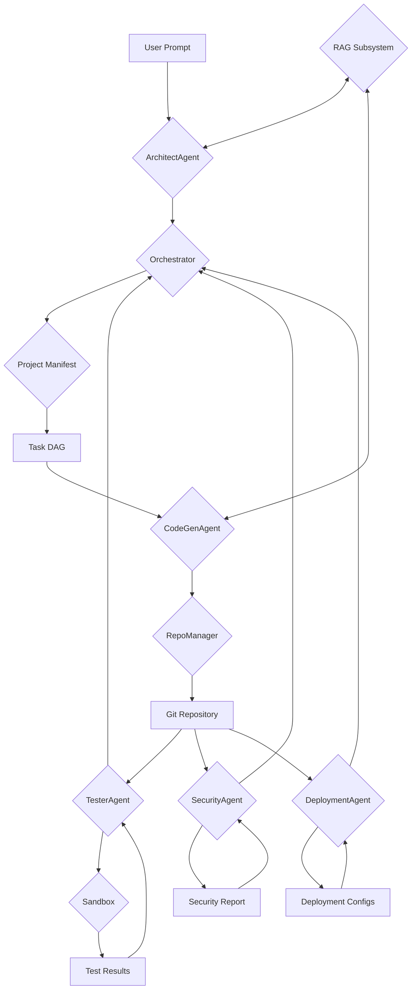

# AgenticCodeGenerator


> A system that generates complete multi-module projects from a single high-level prompt.

## Overview

AgenticCodeGenerator is an AI-powered system that automates the entire software development lifecycle, from high-level concept to a fully deployable application. It leverages a multi-agent architecture, Retrieval-Augmented Generation (RAG), and a secure sandbox to generate, test, and deploy code with minimal human intervention.

## Architecture

The system is designed with a modular, agent-based architecture. An Orchestrator manages a series of specialized agents, each responsible for a specific phase of the development process.



### Key Components:

- **Orchestrator:** Manages the entire workflow, from planning to deployment.
- **Agents:**
    - `ArchitectAgent`: Creates the project plan/manifest.
    - `CodeGenAgent`: Generates code.
    - `TesterAgent`: Runs tests and suggests fixes.
    - `SecurityAgent`: Scans for vulnerabilities.
    - `DeploymentAgent`: Generates deployment configurations.
    - `FixerAgent`: Attempts to fix issues found by other agents.
- **Retrieval-Augmented Generation (RAG):** Provides contextual information to the agents.
- **RepoManager:** Manages the Git repository for the generated project.
- **Sandbox:** A secure environment for running tests and builds.

## Features

- **Automated Code Generation:** Generate entire projects from a single prompt.
- **Multi-Agent System:** Specialized agents for each development phase.
- **Retrieval-Augmented Generation:** Enhance code quality with contextual information.
- **Automated Testing:** Ensure code quality with automated tests in a secure sandbox.
- **Security Scanning:** Identify and mitigate security vulnerabilities.
- **Automated Deployment:** Generate deployment configurations for various platforms.
- **Human-in-the-Loop:** Allow for human intervention and approval at critical stages.

## Getting Started

### Prerequisites

- Python 3.8+
- pip

### Installation

1. Clone the repository:
   ```bash
   git clone https://github.com/your-username/AgenticCodeGenerator.git
   ```
2. Navigate to the project directory:
   ```bash
   cd AgenticCodeGenerator
   ```
3. Install the dependencies:
   ```bash
   pip install -r requirements.txt
   ```

## Project Structure

```
/home/Thamizh/Projects/AgenticCodeGenerator/
├───.gitignore
├───DESIGN.md
├───main.py
├───prompt.txt
├───pyproject.toml
├───README.md
├───requirements.in
├───requirements.txt
├───.git/...
├───config/
│   └───config.yaml
├───src/
│   ├───__init__.py
│   ├───config_loader.py
│   ├───logging_setup.py
│   ├───metrics.py
│   ├───review_api.py
│   ├───agents/
│   │   ├───__init__.py
│   │   ├───architect_agent.py
│   │   ├───base_agent.py
│   │   ├───code_generator.py
│   │   ├───deployment_agent.py
│   │   ├───fixer_agent.py
│   │   ├───security_agent.py
│   │   └───tester.py
│   ├───orchestrator/
│   │   ├───__init__.py
│   │   └───orchestrator.py
│   ├───rag/
│   │   ├───__init__.py
│   │   ├───indexer.py
│   │   └───retriever.py
│   ├───repo_manager/
│   │   ├───__init__.py
│   │   └───repo_manager.py
│   └───sandbox/
│       ├───__init__.py
│       └───sandbox_runner.py
├───tests/
│   └───test_placeholder.py
└───venv/
    ├───bin/...
    ├───include/...
    ├───lib/...
    └───share/...
```

## Development Roadmap

The development of AgenticCodeGenerator is planned in the following iterations:

- **Iteration 0:** System Scoping & Architecture
- **Iteration 1:** Project Setup
- **Iteration 2:** Orchestrator & Workflow Engine
- **Iteration 3:** Agent Framework
- **Iteration 4:** Retrieval-Augmented Generation (RAG)
- **Iteration 5:** Code Generation & Repo Manager
- **Iteration 6:** Sandbox & Testing
- **Iteration 7:** Security & Compliance
- **Iteration 8:** Multi-Agent Orchestration
- **Iteration 9:** CI/CD & Deployment
- **Iteration 10:** Human-in-Loop & Review UI
- **Iteration 11+:** Scaling & Continuous Improvement

## Contributing

Contributions are welcome! Please feel free to submit a pull request.

## License

This project is licensed under the MIT License. See the [LICENSE](LICENSE) file for details.